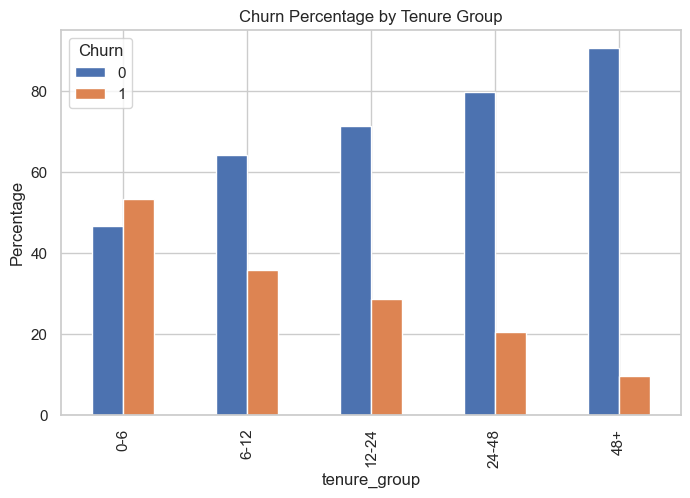
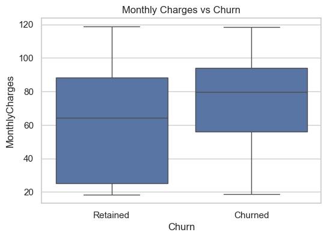
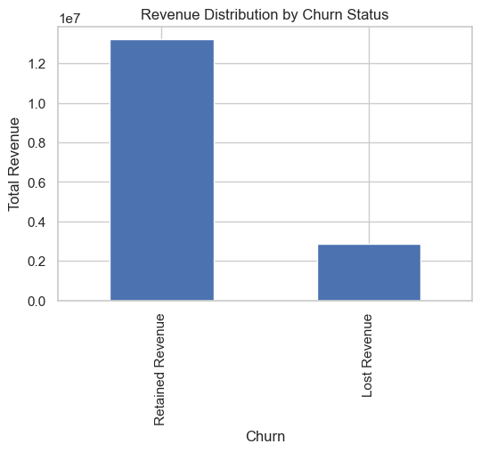

# SaaS Subscription Revenue & Churn Analysis

## 📌 Project Overview
This project analyzes customer churn behavior in a subscription-based SaaS business.  
The objective is to measure churn rate, evaluate revenue impact, and identify retention opportunities.

## 📊 Dataset
The dataset contains 7,043 customer records with features including:
- Tenure
- Monthly Charges
- Total Charges
- Contract Type
- Churn Status

## 🛠 Tools Used
- Python
- Pandas
- NumPy
- Matplotlib
- Seaborn

## 📈 Key Performance Indicators

- Total Customers: 7,043
- Churn Rate: ~26.5%
- Total Revenue: ~16M
- Revenue Lost Due to Churn: ~2.86M
- Revenue Loss Percentage: ~17.8%

## 🔍 Key Findings

- Over 53% of churn occurs within the first 6 months.
- Month-to-month contracts show highest churn (~42%).
- Two-year contracts show lowest churn (~2.8%).
- Churned customers pay higher monthly charges but have lower tenure.
- 17.8% of total revenue is lost due to churn.

## 💡 Business Recommendations

1. Improve onboarding experience for customers within first 6 months.
2. Encourage customers to migrate to long-term contracts.
3. Monitor high-paying month-to-month customers for early churn risk.
4. Implement proactive retention campaigns during early lifecycle stages.

## 📷 Visual Insights

### Churn by Tenure

### Churn by Contract Type

### Monthly Charges vs Churn

### Revenue Distribution

## 📌 Conclusion
Churn is heavily concentrated in early subscription stages and among low-commitment customers.  
Strategic retention efforts focused on early engagement and long-term contract adoption can significantly improve revenue stability.

